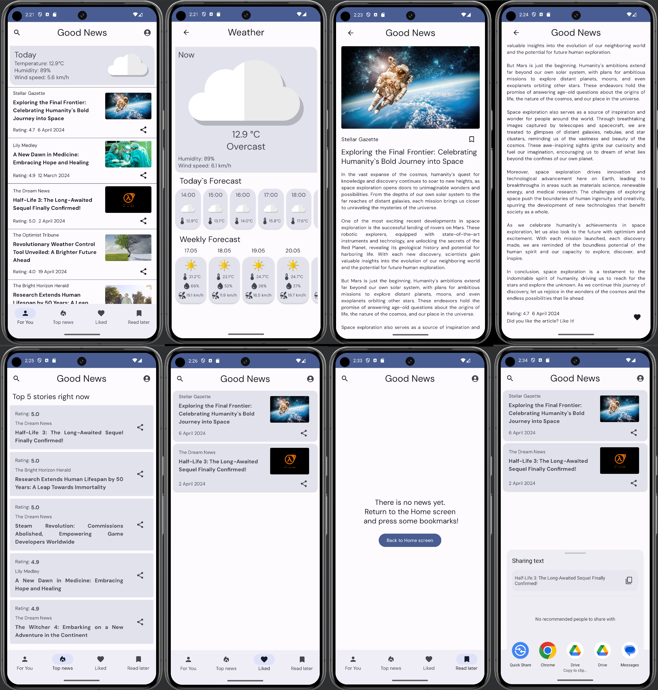

# Good News Application
Good News is a news app, built with Jetpack Compose. 
The main idea was to create an app that shows positive AI generated news.
Right now news was created by AI and manually recorded in a asset database.
In the future, I will implement a backend server that would generate news, and also add missing 
functionality (registration, search and adaptive for various screen sizes).

## Screenshots

## Features
This app consists of six screens: 
home screen - main screen with weather item and news articles (screenshot 1);
weather screen - screen with weather forecast data (screenshot 2);
news item screen - screen with selected news article (screenshots 3-4);
top news screen - screen with 5 news articles, that have highest rating (screenshot 5);
liked news screen - screen with news that user liked on news item screen (screenshot 6);
read later news screen - screen with news that user bookmarked on news item screen (screenshot 7).

### Navigation
Navigation between screen is done using the Jetpack's Navigation component. 
NavHost and navigation routes located in: app/src/main/java/ui/navigation
To create bottom navigation bar there are NavigationItemContent data class, located 
in: app/src/main/java/domain/news/NavigationItemContentList.kt

### Architecture
The application was created based on the principles of clean architecture. 
Therefore, all files are distributed into packages data, di, domain, and ui.

#### UI
In the implementation of UI, the Model-view-viewmodel (MVVM) architectural pattern was used.
All screens have it's own viewmodel and uiState data class.

For realisation info of UI check: app/src/main/java/ui/screens/

#### Data
As mentioned before news articles was generated by AI and manually recorded in a asset database.
The Room library was used to work with the database. 
NewsEntity, NewsDao, NewsDataBase, and OfflineNewsRepository files located 
in: app/src/main/java/data/news/
Also there is a NewsRepository interface located in: app/src/main/java/domain/news/NewsRepository.kt

To get weather data was created a request to https://open-meteo.com/ by using Retrofit library with
OkHttp3 library and Retrofit2-kotlinx-serialization-converter.
For realisation info check:
app/src/main/java/data/weather/
app/src/main/java/domain/weather/

To send the request, it was also necessary to obtain the user's location data by requesting the 
necessary permissions. To achieve this was used GMS Location library, and there is some code in 
MainActivity.kt (to launch user permission confirmation) and location tracker realisation:
app/src/main/java/data/weather/LocationTrackerImpl.kt
app/src/main/java/domain/weather/LocationTracker.kt

#### Domain
Contains some files for organizing work between UI and Data layers.
app/src/main/java/domain/

app/src/main/java/domain/weather/WeatherType.kt and weather drawables was taken from
github.com/philipplackner/WeatherApp

#### DI
This application was created using Manual DI, all dependencies were placed in the AppContainer.kt 
file located in app/src/main/java/di/AppContainer.kt . In this file instances of newsRepository,
weatherRepository (and RetrofitService) and locationTracker were created and used in whole app.
